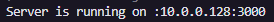
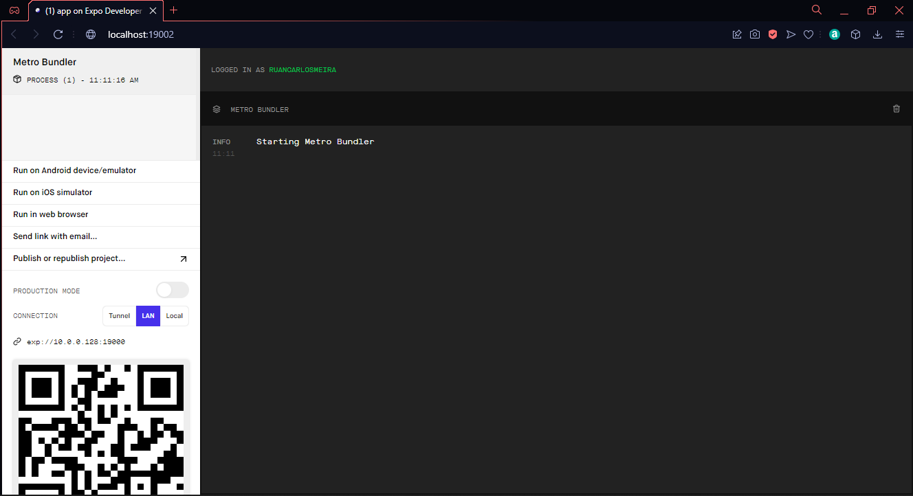

<h1 align="center">
    Teste prático Delta
</h1>

<p align="center">
  <a href="#sobre-este-projeto">Sobre esse Projeto</a>&nbsp;&nbsp;&nbsp;&#149;&nbsp;&nbsp;&nbsp;
  <a href="#como-executar">Como executar</a>&nbsp;&nbsp;&nbsp;&#149;&nbsp;&nbsp;&nbsp;
  <a href="#videos">Videos</a>&nbsp;&nbsp;&nbsp;&#149;&nbsp;&nbsp;&nbsp;
  <a href="#considerações">Consideracoes</a>&nbsp;&nbsp;&nbsp;&#149;&nbsp;&nbsp;&nbsp;
</p>

## Sobre este projeto

Esse projeto consiste em desenvolver um CRUD para criar alunos na plataform, e nesse CRUD possui os campos nome, endereço e foto, sendo necessário desenvolver o backend em técnologia a sua escolha e um aplicativo mobile para interagir com o mesmo em React Native

<br></br>

## Como executar

Primeiros passos para rodara a aplicação, Inicie pelo backend.

<br></br>

## Modificar o .env

Na pasta src possui um arquivo com ".env.example" modificar para somente ".env"

<br></br>

## Backend:

vá no terminal e apartir da pasta main rode os comandos abaixo.

```
#instalação

    cd backend
    yarn install

#iniciar

    yarn start
```

<br></br>

## Ip da aplicação

Após iniciar a aplicação vai aparecer no console o IP onde a máquina está rodando a aplicação, isso deverá ser salvo para utilizar na configuração do aplicativo mobile.

<h1 align="center">
    
</h1>

<br></br>

## Aplicativo Mobile

O Aplicativo foi iniciado utilizando expo bareworkflow para otimização do tempo, então é necessário ter instalado o Expo sdk 5.4.8 a ultima versão, e para rodar no dispositivo móvel é necessário ter o Expo Go instalado no celular.

<br></br>

## Passos iniciais

Primeiro é necessário acessar o arquivo "config.json" dentro da pasta src na raiz do app, e modificar o
"BASE_URL" para o valor obtido quando o backend iniciou.

<br></br>

## App

vá no terminal e apartir da pasta main rode os comandos abaixo.

```
    #instalação

        cd app
        yarn install

    #iniciar

        expo start

```

<br></br>

## Tela do Expo

Após iniciar o expo ele irá abrir uma página no navegador com a página do expo!

<h1 align="center">
    
</h1>

<br></br>

## Expo Go

Após abrir a tela do Expo é só ir no aplicativo Expo go e escanear o QR code mostrado na imagem anterior.

<br></br>

# Videos

Videos da aplicação funcionando.

<br></br>

## Aplicativo funcionando

Criando um novo usuário!

<h1 align="center">
    
</h1>

Alterando sua foto!

<h1 align="center">
    
</h1>

# Considerações

Para a entrega rápida do projeto alguns passos foram ignorados, etapas de tratativas no middleware no backend, validação do usuário antes de fazer as alterações entre outras,

<br></br>

## Backend

sobre o projeto a primeira abordagem era subir o backend no Heroku com um banco de dados em postgresql. E assim foi feito, porém ao salvar as fotos no servidor do Heroku foi notado que periodicamente o Heroku limpa os arquivos temporários salvos nele, assim perdendo as fotos e quebrando o banco.

Por fim foi melhor trocar para um servidor rodado na máquina mesmo e com um banco de dados sqlite3 para ser salvo junto com o servidor.

<br></br>

## App

Para o app optei por utilizar o expo para iniciar rapidamente o projeto e como não era necessário fazer nada nativo como BLE ou algo do gênero, mas optei por bare workflow pois ainda talvez fosse necessário algumas permissões para acessar a galeria.

<br></br>

## Pendências

No app faltou algumas coisas que seriam interessantes em um app real, como:

- Mensagens de erro e conclusão no modal quando fosse criado usuários, atualizados ou deletados
- Fazer a validação dos campos preenchidos antes de submeter para api
- Correção em um bug ao apagar usuário que não possui foto.
- Otimização nas rotas e chamadas da api.
- Criação de uma rotina de testes unitários para os componentes e páginas.

e diversas outras coisas.

OBS: o loading antes de abrir o modal para criar usuário é proposital para mostrar pois em todas as chamadas da api a resposta é tão rápida por ser na mesma rede que ele nem chegava a aparecer.
